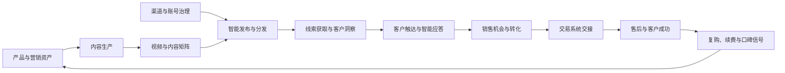

# AI 增长与销售平台产品蓝图

## 产品定位

这是一个可接入不同产品的独立平台，把产品事实转化为合规内容和视频矩阵，通过授权渠道获得线索并完成客户沟通、销售转化、交易交接和售后服务。它不是自动群发工具，也不是视频工厂的附属页面。

## 统一业务闭环

每个产品接入时建立独立 Product Profile：产品事实、价格权益、目标客户、允许渠道、品牌规范、证据来源、禁用声明、转化目标、交易系统和售后知识库。任何生成内容都必须引用该 Profile，避免模型自行发明产品能力。

## 十个业务域

| 业务域 | 核心能力 | 业务结果 |
| --- | --- | --- |
| 产品与营销资产 | 产品接入、卖点、价格、受众、证据、品牌与多语言 | 可复用的产品事实源 |
| 智能内容生产 | 文案、图文、脚本、落地页与审核 | 合格内容资产数、审核通过率 |
| 视频与内容矩阵 | 脚本、素材、成片、版本变体与渠道适配 | 有效视频数、素材复用率 |
| 渠道与账号治理 | 账号申请、实名授权、凭据引用、角色和健康度 | 可用合规账号数、账号风险率 |
| 智能发布与分发 | 排期、审批、发布、失败恢复、追踪与归因 | 发布成功率、触达、有效互动 |
| 线索获取与客户洞察 | 合法采集、去重、补全、评分、分群和同意状态 | 有效线索数、合格率、获客成本 |
| 客户触达与智能应答 | 受控触达、需求识别、答复、预约和人工升级 | 回复率、有效会话、预约率 |
| 销售机会与转化 | CRM、商机、跟进、方案、报价、审批和预测 | 商机金额、转化率、销售周期 |
| 交易系统交接 | 客户、商品、价格、合同、订单和支付意向交接 | 交接成功率、成交金额 |
| 售后与客户成功 | 机器人客服、知识答复、工单、售后、续费增购 | 解决率、满意度、续费和增购 |

## Agent 与 Skill 编排

每个业务域都执行 `STRATEGY → EXECUTE → GOVERN → OPTIMIZE`。策略 Agent 读取产品和经营目标；执行 Agent 调用内容、媒体、渠道、CRM 或客服 Skill；治理 Agent 校验授权、事实、隐私、品牌和平台规则；分析 Agent读取业务结果并调整下一轮任务。所有阶段进入同一 Persistent Kernel，具备 Task、Attempt、Lease、Fencing、Approval、Outbox 和 Report，不另建 Scheduler 或 Worker。

平台需要的专业 Runner 分为：Content Runner、Media Runner、Channel Runner、Lead Intelligence Runner、Engagement Runner、CRM Runner、Transaction Connector Runner、Customer Service Runner。未接通真实连接器时必须显示 `BLOCKED` 或模拟结果，不能显示为真实发布、真实客户或真实成交。

## 自动化安全边界

- 平台账号申请可以自动准备资料，但实名验证、协议确认、验证码和最终注册必须由授权人员完成。
- 自动联系、加客户和消息答复必须具备合法来源、客户同意、退订机制、频率限制、安静时段和平台规则校验。
- 高风险话术、价格承诺、合同、退款、投诉、敏感客户和模型低置信度答复必须转人工。
- 凭据只保存 Credential Reference，禁止把密码、Token、Cookie 或验证码写入 Goal、Task、日志和数据库业务字段。
- 发布、外联、报价、交易和退款分别使用独立 Approval，不允许一个审批跨阶段重放。
- 禁止绕过平台 API、反爬机制、实名要求、隐私规则或封禁限制。

## 统一前台驾驶舱

Studio 首页是集团统一 AI 业务驾驶舱，而不是任何单个平台的首页。顶层展示七个平台的运行状态和经营结果；进入平台后展示该平台的目标、流程、队列、Agent、异常、审批和 KPI；进入一次 Campaign 后展示从内容到售后的完整时间线。

增长销售平台驾驶舱重点展示：在售产品、运行 Campaign、待审核内容、待发布资产、账号健康、有效线索、活跃会话、商机漏斗、预计成交、订单交接、售后工单、人工接管和 ROI。技术性的 Attempt、Lease、Fencing 收入高级运行详情，不占据经营主视图。

## 产品化实施路线

1. GS-000：产品边界、数据契约、合规与 KPI 基线。
2. GS-010：Product Profile 与 Campaign 模型。
3. GS-020：内容、视频工厂和素材资产集成。
4. GS-030：渠道账号、凭据、审批和健康度治理。
5. GS-040：发布排期、矩阵分发和效果归因。
6. GS-050：线索模型、合法来源、去重、评分和客户同意。
7. GS-060：会话、需求识别、知识答复、频控和人工接管。
8. GS-070：CRM 客户、商机、方案、报价和预测。
9. GS-080：交易系统幂等交接和状态回流。
10. GS-090：售后机器人、工单、续费和客户成功。
11. GS-100：统一驾驶舱、业务结果和 Morning Report。
12. GS-110：端到端验收、风控演练和分阶段发布。

最短可用路径为 `GS-000 → GS-010 → GS-020 → GS-030 → GS-040 → GS-050 → GS-060 → GS-070 → GS-080 → GS-100 → GS-110`。售后域在交易交接稳定后并行建设。
