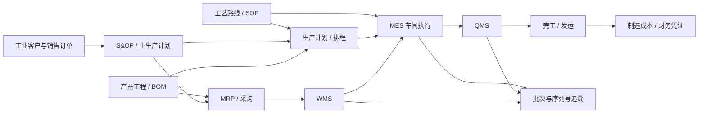

# 智能制造 ERP 平台产品蓝图

## 定位

智能制造 ERP 是面向集团自有生产企业的独立业务平台。它连接市场需求与实物交付，覆盖产品工程、BOM、工艺 SOP、销售订单、S&OP、MRP、采购、生产、质量、WMS、设备、成本和追溯。

## 核心原则

- BOM 必须区分设计 BOM 与制造 BOM，并具备版本、生效日期、签审、工程变更和替代料控制。
- SOP 与工艺路线绑定到产品、版本、工序和工作中心；生产现场只能使用已生效版本。
- WMS 是库存、库位、批次和序列号事实源；MES 不自行维护第二套库存。
- 制造 CRM 负责工业客户、询报价、样品、销售订单和交期承诺；营销获客由 AI 增长销售平台负责。
- 集团财务拥有总账和集团核算；制造 ERP 拥有制造成本明细并通过受控凭证接口入账。
- 集团人力提供组织、人员、岗位和身份；制造 ERP 管理班组、技能授权和作业责任引用。
- 任何库存、质量放行、报工、成本结转和工程变更动作必须具备状态机、幂等、审批、审计与并发控制。

## 经营驾驶舱

生产企业视图重点展示：订单交付率、计划达成率、齐套率、产能负荷、OEE、一次合格率、不良与 CAPA、在制品、库存周转、供应商交付、制造成本、批次风险和延期预警。董事长统一驾驶舱只展示集团级摘要，进入制造平台后再钻取工厂、车间、产线、订单和批次。

## 平台间集成

| 上下游平台 | 制造 ERP 接口 |
| --- | --- |
| AI 增长与销售平台 | 合格客户、商机、需求和市场活动归因 |
| 集团战略平台 | 制造经营目标输入与实际值回传 |
| 集团人力平台 | 组织、人员、岗位、技能与身份引用 |
| 集团财务平台 | 采购、库存、生产、销售和成本凭证及入账结果 |
| 智慧园区平台 | 厂区空间、能耗、安全或设备环境数据；业务表保持隔离 |

当前任务图为 `ME-000` 至 `ME-150` 共 16 项。最短核心路径为 `ME-000 → ME-010 → ME-020 → ME-030 → ME-050 → ME-070 → ME-080 → ME-090 → ME-100 → ME-120 → ME-130 → ME-150`。
