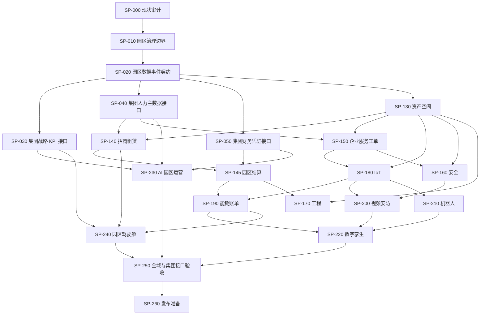

# 智慧园区业务平台长期完善计划（v2）

## 目标与边界

持续完善智慧园区业务平台，以真实代码、数据模型、API、页面和可重复验证证据作为完成标准。集团战略执行、集团人力资源、集团财务是独立平台，不作为智慧园区模块建设；本计划只建设与它们的受控集成契约。

## 执行原则

- 统一使用 Studio 现有 Planner、Kernel、Scheduler、Resident Worker、Lease、Fencing、Activation Gate 和 Report。
- 真实开发必须使用 CODEX，CONTROLLED_STUB 不得把任务标记为完成。
- 每项任务最多一次真实 Attempt；失败后进入人工复核，不自动扩大权限。
- 不 push、不 merge、不 deploy；每个实施批次独立验证和提交。
- 旧版 v1 计划保留为审计历史，在未产生 Attempt 的前提下标记为 `CANCELLED/SUPERSEDED`。

## 依赖图

可执行定义以 `packages/domain-center/lib/smart-park-program.mjs` 为唯一任务图源。当前为 21 个任务，阶段依次为 FOUNDATION、GROUP_INTEGRATION、CORE_OPERATIONS、INTELLIGENT_OPERATIONS、MANAGEMENT、ACCEPTANCE、RELEASE。

## 最短实施路径

`SP-000 → SP-010 → SP-020 → SP-130 → SP-140 → SP-145 → SP-250 → SP-260`

这条路径先稳定园区资产、招商租赁和园区结算主链；集团战略、人力、财务只通过 SP-030/040/050 接口任务接入，绝不在智慧园区内复制建设。
